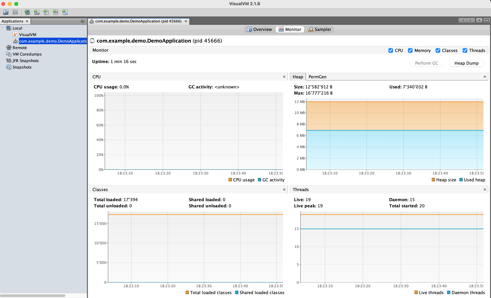

# Native Spring Boot 🍃🐰

[](https://github.com/alina-yur/native-spring-boot/actions) [](https://snyk.io/test/github/alina-yur/native-spring-boot)

## What is GraalVM and why GraalVM?

GraalVM is a JDK, like the other JDKs you might know, but with unique features and capabilities.

One such feature is the **Graal JIT compiler**. It's a highly optimizing compiler, which is the outcome of over a decade of research at Oracle Labs. By moving to the GraalVM JIT (by just setting GraalVM as your Java runtime), you can potentially win an extra 10-15% performance improvement. Not every application is performance-critical, but for those that are, every percent of performance improvement — especially with easy migration and no manual tuning required—is a huge win. This improvement is confirmed by both large-scale organizations, such as Oracle NetSuite, using GraalVM JIT in production at scale, and community reports, such the one from Ionut Balosin and Florin Blanaru (https://ionutbalosin.com/2024/02/jvm-performance-comparison-for-jdk-21/), where the Oracle GraalVM JIT shows performance improvement of 23% on x86_64 and 17% on arm64 compared to the C2 JIT compiler.

Another feature that GraalVM adds to the JDK is the ability to **Embed other languages** in your Java application. We are lucky to have the incredibly rich Java ecosystem at our fingertips—whenever we have a problem that needs solving, there's always a Java library or tool for that. But sometimes we need to reach out for one specific library from another ecosystem, such as all the cool ML libraries in Python, or utilize the scripting capabilities of JavaScript. GraalVM, and more specifically its Truffle component, enables you to do just that: embedding what we call “guest language code” in your Java application. You use what you need to use, and GraalVM will take care of the rest: interoperability, performance, tooling, and security. By using GraalVM, you can combine the rich and powerful Java platform with any other library or tool that you like—how cool is that?

Last, but not least, is GraalVM's **Native Image**, which enables you to compile your application ahead of time into a small and fast native executable. This is our main topic for today—so let's dive in.


## Meet GraalVM Native Image

So what is Native Image and how does it work exactly? Native Image is a feature in GraalVM that employs the Graal compiler to compile your application ahead of time into a native executable. The main reason you might want to do this,  is to shift the majority of the work that the JVM normally performs at run time, such as loading classes, profiling, and compilation, to build time,removing that overhead when you run your application. In addition to ahead-of-time (AOT) compilation, Native Image performs another important task: it takes a snapshot of your heap with objects that are safe to initialize at build time, to also reduce the allocation overhead.

Native Image compiles your application into a native executable with the following advantages:


Native Image compiles your Java application into a native executable with the following advantages:

* Fast startup and instant peak performance, as the native executable doesn't need to warm up;
* Low memory footprint, as no memory is used to profile and compile code at runtime;
* Throughput on par with the JVM;
* Compact packaging by including only reachable code;
* Additional security, by eliminating unused code and reducing the attack surface.

Now, let's take it for a spin!🏎️


## 1. Spring AOT: Spring meets GraalVM 🤝

Spring Boot 3.0 introduced the general availability of GraalVM Native Image in Spring projects, and here is how it works.

By default Spring Boot works in a way that at runtime it pulls your project's bytecode classes/jars and configuration from all the different sources, resolves it, and creates an internal representation of your application. Interestingly, GraalVM Native Image does something very similar — it analyzes your code and configuration and creates an internal representation of your application — but it does this at build time. The Spring AOT engine was designed to bridge this gap between two worlds. It transforms your application configuration into native-friendly functional configuration and generates additional files to assist native compilation of Spring projects:

* Java source code (functional configuration)
* Bytecode for things such as dynamic proxies
* Runtime hints for dynamic Java features when necessary (reflection, resources, and so on).

#### GraalVM 25 and Spring Boot 4 update

With the latest versions, both the native compilation and startup performance are impressive:

| Metric | Value |
|--------|-------|
| Native compilation time | 1m 3s |
| Startup time | 0.046s |


## 2. Build a Native Spring Application

Let's go to Josh Long's second favorite place — start.spring.io — and generate our project. The settings I chose are Spring Boot 4.0.2, Java 25, Maven, and my dependencies are Spring Web and GraalVM Native Image. That's all. Let's download and unpack our project, and add a HelloController.java so we have something to work with:

```java
package com.example.demo;

import org.springframework.web.bind.annotation.RestController;
import org.springframework.web.bind.annotation.GetMapping;

@RestController
public class HelloController {

    @GetMapping("/hello")
    public String hello() {
        return "Hello from GraalVM and Spring!💃";
    }
    
}
```

Guess what — we would also need GraalVM. The easiest way to install it on Linux and macOS is with SDKMAN!. As I'm writing this article, the latest released version is GraalVM for JDK 25:

```shell
sdk install java 25.0.2-graal
```


Now we are all set!
Remember GraalVM is a normal JDK, right? You can run your application as you would on any other JDK:

```shell
mvn spring-boot:run
...
Tomcat started on port 8080 (http) with context path '/'
Started DemoApplication in 1.106 seconds (process running for 1.363)

```

Navigate to `http://localhost:8080/hello` and you'll see our message.

So far so good, but where's the fun in that? Let's compile it to a native executable with GraalVM Native Image:

```shell
mvn -Pnative native:compile
```

Now let's run our application:

```shell
./target/demo
...
Tomcat started on port 8080 (http) with context path '/'
Started DemoApplication in 0.048 seconds (process running for 0.051)
```


Navigating to `http://localhost:8080/hello` gives us the same message, only now our application is much faster—it started in 48 milliseconds!

We can also quickly assess the runtime characteristics of our application. The size of our application is 62MB, and measuring the runtime memory usage (RSS) while serving incoming requests gives us 69 MB. How great is this!

But let's explore performance more, and for that let's talk about specific performance optimizations in Native Image.


## 2. Optimize performance

You might say: “ok, I can see how compiling my applications with Native Image is great for startup, memory usage, packaging size, but what about peak performance?” Indeed, we know that at runtime the JVM monitors our application, profiles it, and adapts on the go to optimize the most frequently executed parts. And we said that Native Image compilation takes place before runtime, so how can you optimize for peak performance? I'm glad you asked! Let's talk about profile-guided optimizations.

### PGO 🚀

One of the most powerful performance optimizations in Native Image is profile-guided optimizations (PGO).

1. Build an instrumented image: 

```mvn -Pnative,instrumented native:compile```

2. Run the app and apply relevant workload:

```./target/demo-instrumented```

```hey -n=1000000 http://localhost:8080/hello```

after you shut down the app, you'll see an `iprof` file in your working directory.

3. Build an app with profiles (they are being picked up via `<buildArg>--pgo=${project.basedir}/default.iprof</buildArg>`):

```mvn -Pnative,optimized native:compile```

Measure max RSS on Mac:

```
/usr/bin/time -l ./target/demo
````


### ML-enabled PGO 👩‍🔬

The PGO approach described above— where the profiles are collected during a training run and tailored to your app — is the recommended way to do PGO in Native Image.

However, there can be situations  when it’s not possible to collect profiles for example, because of your deployment process. In that case, it's still possible to get profiling information and optimize your app via machine-learning-enabled PGO. Native Image contains a pre-trained ML model that predicts the probabilities of control flow graph branches, which enables it to additionally optimize the app. This is again available in Oracle GraalVM: it activates automatically in the absence of user-provided profiles.

If you are curious about the impact of this kind of optimization, you can disable it with `-H:-MLProfileInference`. In our measurements, this optimization provides ~6% runtime performance improvement, which is pretty cool for an optimization you automatically get out of the box.


### G1 GC 🧹

There could be different GC strategies. The default GC in Native Image, Serial GC, can be beneficial in certain scenarios, for example if you have a short-lived application or want to optimize memory usage. 

If you are aiming for the best peak throughput, our general recommendation is to try the G1 GC (Note that you need Oracle GraalVM for it). 

In our `optimized` profile it's enabled via `<buildArg>--gc=G1</buildArg>`.

### `-march=native`

If your production CPU architecture matches your development environment, or shares the same CPU features, use `-march=native` for additional performance. This option enables the Graal compiler to use all the CPU features available on the build machine, which will improve the performance of your application. Note that if you are building your application to distribute to your users or customers (where the exact production environment is unknown) it's better to use the compatibility mode: `-march=compatibility`.

### Optimization levels in Native Image

There are several levels of optimizations in Native Image, that can be set at build time:

- `-O0` - No optimizations: Recommended optimization level for debugging native images;

- `-O1` - Basic optimizations: Basic GraalVM compiler optimizations, still works for debugging;
 
- `-O2`  - Advanced optimizations: default optimization level for Native Image;

- `-O3` - All optimizations for best performance;

- `-Ob` - Optimize for fastest build time: use only for dev purposes for faster feedback, remove before compiling for deployment;

- `-Os` - Optimize for image size;

- `--pgo`: Using PGO will automatically trigger `-O3` for best performance.

## Bonus level: memory considerations

A little lesser known fact: nn Oracle GraalVM, by default you benefit from compressed references to Java objects: they use 32 bit instead of 64 bit. It's enabled by default, so you just benefit from this optimization. If you are curious about the impact of this optimization, you can disable it for comparison with `-H:-UseCompressedReferences`. 

For our `native-spring-boot` app, the impact is the following:

* RSS of a base native executable, under high load: 234520 KB
* RSS of a native executable without compressed references, under high load: 376828 KB


## 3. Testing 🧪

GraalVM's Native Build Tools support testing applications as native images, including JUnit support. The way this works is that your tests are compiled as native executables to verify that things work in the native world as expected. Test our application with the following:

 ```mvn -PnativeTest test```

In our example, `HttpRequestTest` will verify that the application returns the expected message.

Native testing recommendation: you don't need to test in the mode all the time, especially if you are working with frameworks and libraries that support Native Image – usually everything just works. Develop and test your application on the JVM, and test in Native once in a while, as a part of your CI/CD process, or if you are introducing a new dependency, or changing things that are sensitive for Native Image (reflection etc). 

## 4. Using Dynamic Java Features and Libraries

Native Image compiles your applications ahead of time at build time. Since we needs a complete picture of your application, it compiles under a closed-world assumption: everything there is to know about your app, needs to be known at build time. Native Image's static analysis will try to make the best possible predictions about the runtime behavior of your application, but for those cases where it's not sufficient, you might need to provide it with configuration files to make things such as reflection, resources, JNI, serialization, and proxies "visible" to Native Image. Note the word "configuration" doesn't mean that this is something that you need to do manually—let's look at all the many ways this can work.

* A library might be designed to be Native-Image friendly [out of the box](twitter.com/YunaMorgenstern/status/1729039787351536084) — this is obviously the ideal scenario. 
* Existing libraries could need additional configuration to make things such as reflection work. Ideally, this configuration will be included within the library itself — for example [H2](https://github.com/h2database/h2database/blob/master/h2/src/main/META-INF/native-image/reflect-config.json). In this case no further action needed from a user – things just work.
* In cases when a library doesn't (yet) support GraalVM, the next best option is having configuration for it in the [GraalVM Reachability Metadata Repository](https://github.com/oracle/graalvm-reachability-metadata). It's a centralized repository where both maintainers and users can contribute and then reuse configuration for Native Image. It's integrated into [Native Build Tools](https://github.com/graalvm/native-build-tools) (Maven and Gradle plugins) and now enabled and pulled by default, so as a user, again — things just work.
For both of those options, a quick way to assess whether your dependencies work with Native Image is the Ready for Native Image page. Note that this is a list of libraries that are known to be continuously testing with Native Image, and there are more compatible libraries out there; but this is a good first step for assessment.
* If your library of interest doesn't provide any support for GraalVM, but you are using a framework version that has Native Image support, such in our case Spring Boot 3.0, you can use the framework support to produce custom “hints” for Native Image:

```java
@RegisterReflectionForBinding(Clazz.class) // will register the annotated element for reflection
```

And for resources:
```java
   public void registerHints(RuntimeHints hints, ClassLoader classLoader) {
        hints.resources().registerResource(new ClassPathResource("myresource.xml"));
    }
    // will register a resource
```

* Now if neither your library nor your framework support GraalVM, you can use the Tracing Agent that comes with Native Image to produce the necessary configuration [automatically](https://www.graalvm.org/latest/reference-manual/native-image/metadata/AutomaticMetadataCollection/).
  * The syntax for working with the agent:
    ```shell
    java -agentlib:native-image-agent -jar ./target/demo.jar
    ```
* Finally, you can provide/extend configuration for reflection, JNI, resources, serialization, and predefined classes [manually in JSON](https://www.graalvm.org/latest/reference-manual/native-image/metadata/AutomaticMetadataCollection/).

Some of those steps look rather scary, but if you are starting a new project, most of the frameworks and libraries will just work. The "Ready for Native Image" page mentioned above contains almost 200 libraries and frameworks, including Micronaut, Spring, Quarkus, Helidon, H2, GraphQL, MariaDB, Netty, MySQL, Neo4j, PostgreSQL, Testcontainers, Thymeleaf, and many others. There has never been a better time to be a Spring Boot and GraalVM developer!(c)


## 6. Deploying 📦

Build a Docker image via Buildpacks:

```
mvn -Pnative spring-boot:build-image
```

Alternatively, build a docker image yourself via included Dockerfile:

Build:

```shell
docker build -f Dockerfiles/Dockerfile.native -t native-spring-boot:latest-native .
```

Verify:

```shell
docker images
REPOSITORY                                          TAG         IMAGE ID      CREATED             SIZE
localhost/native-spring-boot-native                 latest      e664158e03d0  About a minute ago  209 MB
```

Run:

```shell
docker run -p 8080:8080 native-spring-boot:latest
```

How to build a statically linked native image:

```shell
docker build -f Dockerfiles/Dockerfile.native.static --build-arg APP_FILE=demo-static -t native-spring-boot-static-scratch:latest .
docker run -p 8080:8080 native-spring-boot-static-scratch:latest
```


Alternatively yet again, if you are on Linux, you can just build a native executable locally and put it into an empty container:

```shell
docker build -f Dockerfiles/Dockerfile.native.static.local --build-arg APP_FILE=demo-static -t native-spring-boot-static-scratch-local:latest .
docker run -p 8080:8080 native-spring-boot-static-scratch-local:latest
```

How linking and choice of the base image affect the image size:

```shell
docker images | grep "native-spring-boot"                                   
localhost/native-spring-boot                        latest     ...  ...  210 MB
localhost/native-spring-boot-static-scratch         latest     ...  ...  89.3 MB
```


### You can significantly reduce the size by going with Native Image:

```shell
➜ docker images | grep "native"                                                                
localhost/native-spring-boot-static-size            latest         ... ...    58.5 MB
localhost/native-spring-boot-static-scratch         latest         ... ...    84.4 MB
localhost/native-spring-boot-native                 latest         ... ...    125 MB
localhost/native-spring-boot-jdk-jlink              latest         ... ...    126 MB
localhost/native-spring-boot-jdk-distroless         latest         ... ...    218 MB
localhost/native-spring-boot-jdk                    latest         ... ...    480 MB
```


## 8. Security

GraalVM’s support for Software Bill of Materials in Native Image helps you build and run native images according to the industry standards of security and compliance. 
Since GraalVM 25, SBOM is embedded by default in all applications built with Oracle GraalVM. Now you can easily track all dependencies to scan and patch your Native Image deployments.
In case you need to disable SBOM generation, use the flag --enable-sbom=false.


Scan native images with `grype`: 

```shell
`native-image-inspect --sbom ./target/demo-sbom | grype -v`
```

Or extract the contents of SBOM locally:

```shell
`native-image-inspect --sbom ./target/demo-sbom>output.json`
```

SBOM location in Spring Boot:

```shell
http://localhost:8080/actuator/sbom
```


## 8. Monitoring 📈

Build an application with monitoring features enabled:

```shell
mvn -Pnative,monitored native:compile
```
This will trigger a profile with the following `buildArgs`: `--enable-monitoring=heapdump,jfr,jvmstat`. You can also opt for using just one of those monitoring features. 

Let's start the app:

```shell
./target/demo-monitored
```

Now in another terminal tab let's start VisualVM (note that you can also `sdk install visualvm`, how cool is this!):

```shell
visualvm
```

And in a yet another terminal tab let's send some load to the app via `hey` (get it [here](https://github.com/rakyll/hey)):

```shell
hey -n=100000 http://localhost:8080/hello
```

You'll see that our application successfully operates and uses minimal resources even under load. 

You can go even further and repeat the experiment but limiting the memory to let's say ridiculous 10 MB and the app will remain operational:

```shell
./target/demo-monitored -Xmx10M
hey -n=100000 http://localhost:8080/hello
```

<div style="text-align: center;">
    
</div>

<p style="text-align: center;">Monitoring GraalVM native applications in VisualVM</p>

## In the lab 👩‍🔬

Profile your application with `perf`:

```shell
 perf record -e cycles -g ./target/demo
 ```

 Visualize the profiling information as a flamegraph:

 ```shell
 perf script | stackcollapse-perf.pl | flamegraph.pl > flamegraph.svg
 ```

## 9. Tips, tricks, and migration recommendations

* Migrate 🚀
    * Add [Native Build Tools](https://graalvm.github.io/native-build-tools/latest/index.html)
    * Alternatively, use recent versions of frameworks
    * Evaluate libraries: graalvm.org/native-image/libraries-and-frameworks
    * Get library config from [GraalVM Reachability Metadata Repository](https://github.com/oracle/graalvm-reachability-metadata) (always on when you use Native Build Tools)
* Build and deploy 👷‍♀️
    * Build and test on GraalVM as the JVM, build with Native  Image closer to the deployment
    * While developing, use the quick build mode with `-Ob`
    * Use CI/CD systems (e.g. GitHub actions) for deployment and cross-platform builds
 * Monitor 📈
    * jvmstat, JFR, JMX, Micrometer, cloud vendor solutions
* Run faster 🚀
    * PGO
    * ML-enabled PGO
    * G1 GC
    * `-march=native`
